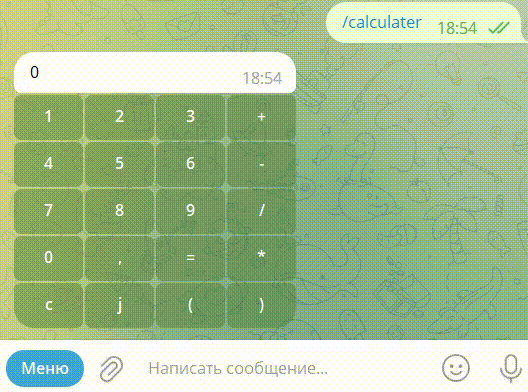

# Калькулятор
Предназначен для выполнения несложных вычислительных операций: сложения, вычитания, умножения и деления. В калькуляторе предусмотрена возможность работы с комплексными и рациональными числами. Есть возможность группировки операций (кнопки со скобками). При вычислении определяет приоритет операций:

    1+1*2= дает в результате 3 

##    Структура

1. calc_bot.py модуль телеграм-бота
2. logger.py модуль логирования
3. complex.py модуль вычисления комплексных чисел
4. rational_test.py модуль вычисления рациональных чисел

### Чтобы запустить телеграм- бот

необходимо настроить окружение -- ввести в консоле команды поочередно:

```python
pip install telebot
pip install PyTelegramBotAPI==2.2.3
pip install PyTelegramBotAPI==3.6.7

# вот так устанавливаем библиотеки к telebot
```
чтобы успешно использовать телеграм-бот, необходимо в 7 строке модуля  calc_bot.py добавить индивидуальный токен телеграм-бота (прилагаю [инструкцию](https://core.telegram.org/bots))

### Интерфейс программы устроен следующим образом:



*Реализация вычисления*

 Так как наш калькулятор предназначен для вычисления рациональных и комплексных чисел, то была реализована функция проверки типа полученных цифр от пользователя для определения, какой модуль нужно использовать для вычисления и обработка события деления на ноль:

```python
# небольшой фрагмент 
    elif data == '=':
        lg.logging.info('The user has selected item = ')
        try:
            if value.count('j') > 0:
                value = c.list_complex(value)
                value = c.calculator(value) 
            else:
                value = rt.get_expression(value)
                value = rt.calculate(value)          
        except:
            value = 'Ошибка!'   
```

### Модуль логирования

Данный модуль предназначен для записи и хранения действий пользователя. Мы записываем действия, выполненные пользователем в определенное время:

```python
# небольшой фрагмент 
import logging

logging.basicConfig(
    level=logging.INFO,
    filename='calculatorbook.log',
    format='[%(asctime)s] [%(levelname)s] [%(module)s] [%(funcName)s: %(lineno)d] => %(message)s',
    datefmt='%d.%m.%Y %H:%M:%S ',
)   
```
Например, вывод после выполнения:

`[25.11.2022 20:06:51 ] [INFO] [calc_bot] [start_message: 66] => The user has selected a command calculater`


Я попробовала для для записи аналитики телеграм-бота создать декоратор `@analytics` (просто для изучения этого вопроса), полученную информацию сохранить в файл формата `.json`:


```python
# небольшой фрагмент 
 def analytics(func:callable):
    total_messages = 0
    users = set()
    total_users = 0
    def analytics_wrapper(message):
        nonlocal total_messages, total_users
        total_messages += 1

        if message.chat.id not in users:
            users.add(message.chat.id)
            total_users += 1

        BD = ['New message:', message.text, 'Total messages:', total_messages, 'Unique users:', total_users]
        def save():
            with open('BD.json', 'w', encoding='utf-8') as fh:
                fh.write(json.dumps(BD, ensure_ascii=False))
        save()
        return func(message)

    return analytics_wrapper 

@bot.message_handler(commands=['start', 'calculater'])
@analytics
def start_message(message):   
    # и так далее

```
Здесь создаю декоратор, фиксирующий выполнения функции запуска калькулятора.

Здесь analytics() является функцией-декоратором. Она является функцией высшего порядка, так как принимает функцию в качестве аргумента, а также возвращает функцию. Внутри analytics() я определила другую функцию, обёртку, так сказать, которая обёртывает функцию-аргумент и затем изменяет её поведение. Декоратор возвращает эту обёртку.

Вывод после выполнения сохраняю в файл формата .json:

`["New message:", "/calculater", "Total messages:", 1, "Unique users:", 1]`

Аналитика по трем направлениям: запуск калькулятора, сколько раз было отправлено это сообщение, количество уникальных пользователей.